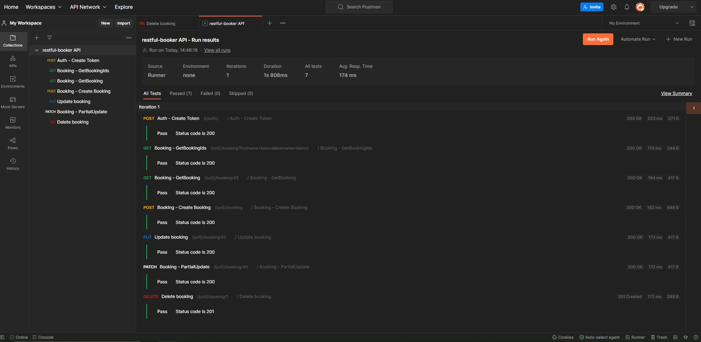
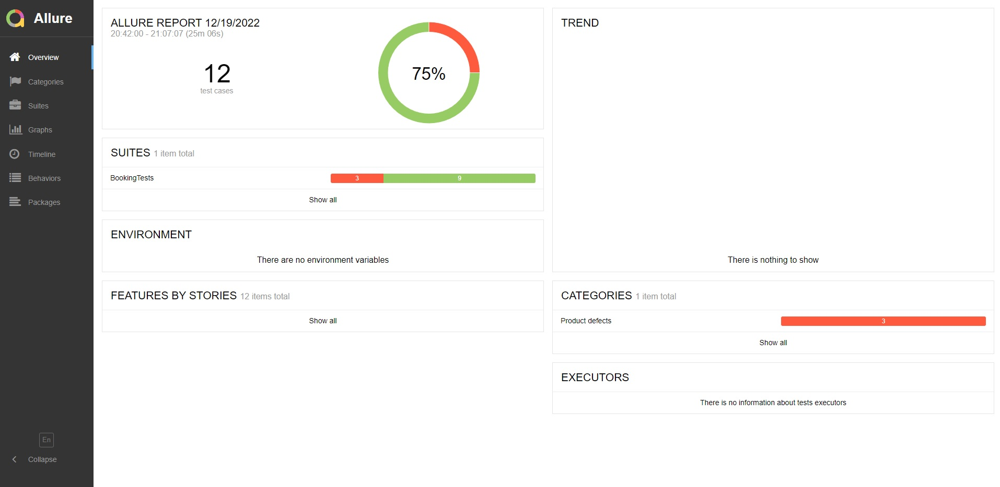

<h2 align="center">📑 Automação de testes de API </h2>

    
Exercício prático realizado durante o bootcamp "GFT Quality Assurance para Mulheres" na plataforma DIO.

    
Objetivo: Explorar o framework RestAssured + JUnit e a geração de reports com o Allure Framework.

     <h3>💻 TECNOLOGIA:</h3>
     
      

🔹 Testes no Postman:

   

🔹 Allure Report:

    
    

